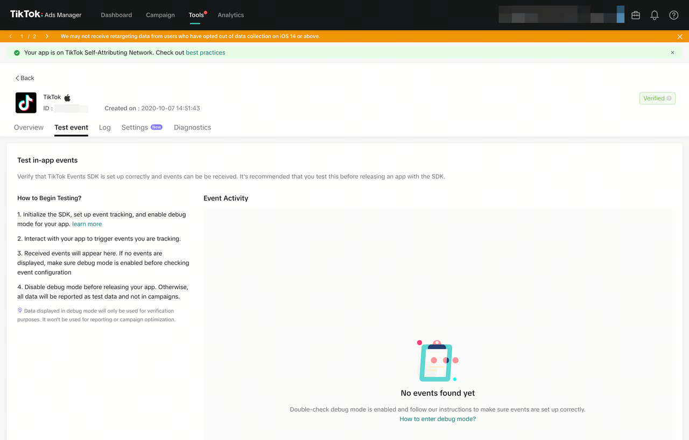

# TikTok Events SDK Flutter Plugin

[](https://pub.dev/packages/tiktok_events_sdk)

A Flutter plugin for integrating the **TikTok Events SDK** into your Flutter app. This plugin allows you to track in-app events, measure user engagement, and optimize your TikTok ad campaigns. It supports both **Android** and **iOS** platforms.

Learn more about TikTok Events SDK:

- [TikTok Events Manager Overview](https://business-api.tiktok.com/portal/docs?id=1739585434183746)
- [TikTok Events SDK for iOS](https://business-api.tiktok.com/portal/docs?id=1739585432134657)
- [TikTok Events SDK for Android](https://business-api.tiktok.com/portal/docs?id=1739585432134658)

---

# TikTok Events SDK for Flutter

A **Flutter** plugin that integrates the [TikTok Events SDK](https://ads.tiktok.com/marketing_api/docs?rid=a0ovbtrvukp&id=1737172325924866) to help you easily initialize the TikTok SDK, identify users, log events, and handle user logout. This plugin supports both **Android** and **iOS**.

---

## Requirements

> **Flutter `>=3.38.0` and Dart `^3.10.0` required.** Starting from `1.2.0` the iOS plugin is migrated to the new `UIScene` lifecycle introduced in Flutter 3.38. If you cannot upgrade Flutter yet, pin to `1.1.5`.

### Android

Have to added the normal permission `com.google.android.gms.permission.AD_ID` to the SDK's AndroidManifest, to allow the SDK to collect the Android Advertising ID on apps targeting API 33.
If your app is targeting children, you need to revoke this permission to comply with Google's Data policy.

Add the Internet and AD_ID permissions to your AndroidManifest.xml:

```xml
<uses-permission android:name="android.permission.INTERNET" />
<uses-permission android:name="com.google.android.gms.permission.AD_ID" />
```

Make sure you are using the latest version of Play Services and Gradle that support com.google.android.gms.permission.AD_ID.

⚠️ If your app targets children, revoke this permission to comply with Google’s data policy.

#### Add JitPack Repository

To ensure proper dependency resolution, add JitPack to your project's settings.gradle or build.gradle file.

For projects using settings.gradle (Recommended)
In your android/settings.gradle, add the following inside dependencyResolutionManagement → repositories:

```gradle
dependencyResolutionManagement {
  repositoriesMode.set(RepositoriesMode.FAIL_ON_PROJECT_REPOS)
  repositories {
    google()
    mavenCentral()
    maven { url 'https://jitpack.io' } // Add JitPack repository
  }
}
```

For older projects using build.gradle
If your project uses build.gradle (Project-level) instead of settings.gradle, add the JitPack repository inside the allprojects.repositories block:

```gradle
allprojects {
    repositories {
        google()
        mavenCentral()
        maven { url 'https://jitpack.io' }  // Add JitPack repository
    }
}
```

### iOS

iOS (App Tracking Transparency in iOS 14+)
Starting from iOS 14, App Tracking Transparency (ATT) permission is required to share IDFA (Identifier for Advertisers) with TikTok. If the user does not grant permission, the IDFA will be zeroed out, which may affect attribution and retargeting audience building.

📌 How to enable ATT on iOS?
1️⃣ Add the NSUserTrackingUsageDescription key to Info.plist:

```xml
<key>NSUserTrackingUsageDescription</key>
<string>Your app uses IDFA to improve ad personalization.</string>
```

## Features

- **Log Events**: Track user actions such as purchases, add-to-cart, content views, and more for deeper insights into user behavior.
- **Identify user**: Easily associate events with specific users through custom identifiers and parameters.
- **Debug Mode**: Test your event tracking before releasing your app.
- **Logout**: Effortlessly clear user identification across both Android and iOS.

---

## Installation

Add the following to your `pubspec.yaml`:

```yaml
dependencies:
  tiktok_events_sdk: ^1.2.0
```

## Usage

### Initialize the SDK

You must initialize the SDK with your TikTok configuration details. This can be done in main.dart or wherever you set up your app:

```dart
// iOS options example
final iosOptions = TikTokIosOptions(
  disableTracking: false, // true would disable ALL tracking
  disableAutomaticTracking: true,
  disableSKAdNetworkSupport: true,
);

// Android options example
final androidOptions = TikTokAndroidOptions(
  enableAutoIapTrack: true, // enable IAP tracking
  disableAdvertiserIDCollection: false,
);

// Pass these options to the initialize method
await TikTokEventsSdk.initSdk(
  androidAppId: 'YOUR_ANDROID_APP_ID',
  tikTokAndroidId: 'YOUR_TIKTOK_ANDROID_ID',
  iosAppId: 'YOUR_IOS_APP_ID',
  tiktokIosId: 'YOUR_TIKTOK_IOS_ID',
  isDebugMode: true,
  logLevel: TikTokLogLevel.debug,
  androidOptions: androidOptions,
  iosOptions: iosOptions,
);
```

> **Important:** By default the SDK starts tracking automatically right after `initSdk`. If you set `disableAutoStart: true` on Android (for example, to wait for user consent under GDPR/LGPD), the SDK will **not** send any events until you explicitly call `TikTokEventsSdk.startTrack()`. Forgetting this call is the most common reason events never reach the TikTok dashboard.

#### Deferred start (manual consent flow)

Use this pattern only if you need to wait for explicit user consent before any tracking begins:

```dart
final androidOptions = TikTokAndroidOptions(
  disableAutoStart: true, // SDK will NOT track until startTrack() is called
);

await TikTokEventsSdk.initSdk(
  // ...same as above
  androidOptions: androidOptions,
);

// Later, after the user grants consent:
await TikTokEventsSdk.startTrack();
```

### In-App Purchase (IAP)

If you enable In-App Purchase (IAP) tracking (via enableAutoIapTrack: true in TikTokAndroidOptions), you must add the following dependency to your android/app/build.gradle:

```gradle
dependencies {
    implementation 'com.android.billingclient:billing:6.1.0'
}
```

This is required for automatic IAP event reporting to work properly.

### Identify a User

If you need to associate events with a specific user, call identify:

```
await TikTokEventsSdk.identify(
  identifier: TikTokIdentifier(
    externalId: '12345',
    externalUserName: 'john_doe',
    phoneNumber: '+1234567890',
    email: 'john.doe@example.com',
  ),
);
```

### Log Events

The TikTok SDK allows you to log both **custom** and **predefined** events to track user actions within your app. You can add optional metadata such as `eventId` and `properties` to give more context about the event.

**Basic Example:**

```dart
import 'package:tiktok_events_sdk/tiktok_events_sdk.dart';

/// Log a custom event with only a name
await TikTokEventsSdk.logEvent(
  event: TikTokEvent(
    eventName: 'custom_event_name',
  ),
);
```

#### Passing Additional properties

To enrich your events with extra data (like pricing, product names, user attributes, etc.), you can pass properties. First, create an EventProperties object with key/value pairs of your choice:

```dart
const event = EventProperties(
  value: 200,
  description: 'product price',
  contentId: 'product_page',
  quantity: 1,
  contentType: '',
);
```

```dart
import 'package:tiktok_events_sdk/tiktok_events_sdk.dart';

await TikTokEventsSdk.logEvent(
      event: TikTokEvent(
        eventName: 'click_product_card',
        eventId: 'event_id',
        properties: const EventProperties(
          contentId: '12345',
          brand: 'Brand Name',
          contentName: 'Category',
          value: 100.0,
          customProperties: {
            'custom_key': 'custom_value',
          },
        ),
      ),
    );
```

### Logout User

When a user logs out of your app, you can clear the identification data:

```dart
await TikTokEventsSdk.logout();
```

## Troubleshooting

Events not showing up in the TikTok Events Manager? Before opening an issue, check the four most common causes below — they account for the vast majority of "events are not arriving" reports.

### 1. You're testing on the iOS Simulator

The TikTok Business SDK does **not** send events from the iOS Simulator. The simulator has no IDFA, no valid device fingerprint, and no SKAdNetwork support, so the native SDK silently drops the events.

**Fix:** Always test on a physical iOS device. The Android emulator works for basic testing, but real devices are still recommended.

### 2. You're looking at the wrong tab in the dashboard

When you initialize the SDK with `isDebugMode: true`, events are sent to the **Test Event** tab of the TikTok Ads Manager, **not** to the **Event Activity** tab.

**Fix:** In the TikTok Ads Manager, go to **Tools → Events**, open your app, and switch to the **Test event** tab (shown below). If you want events to appear in **Event Activity** instead, set `isDebugMode: false` in a release build.



### 3. Your app is still pending verification on TikTok

If your app has not been verified yet on the TikTok Events platform, only **Test Events** will work. The **Event Activity** tab stays empty until verification is complete.

**Fix:** Complete the app verification process in the TikTok Business Center, then test again with `isDebugMode: false` on a physical device.

### 4. You set `disableAutoStart: true` but never call `startTrack()`

On Android, `disableAutoStart: true` tells the native SDK to wait for explicit consent before sending anything. If you never call `TikTokEventsSdk.startTrack()` afterwards, no event will ever reach TikTok.

**Fix:** Either remove `disableAutoStart: true` from your `TikTokAndroidOptions` (the SDK then starts automatically), or call `await TikTokEventsSdk.startTrack()` once the user has granted consent. See the [Deferred start](#deferred-start-manual-consent-flow) section above.

### Still not working?

If you've checked all four above and events are still missing:

- Confirm your `androidAppId`, `tikTokAndroidId`, `iosAppId` and `tiktokIosId` match exactly what is shown in the TikTok Events Manager (no extra whitespace).
- Set `logLevel: TikTokLogLevel.debug` and `isDebugMode: true` and look for native log lines tagged `TikTokBusinessSdk` (Android Logcat) or `TikTok` (iOS Console).
- Make sure your network is not blocking `*.tiktokv.com` / `*.tiktokw.us` requests.
- Open an issue with the full log output, your initialization call (with the IDs redacted), and the platform/device you are testing on.

## Contributions

🍺 Pull requests are welcome!

Feel free to contribute to this project.
